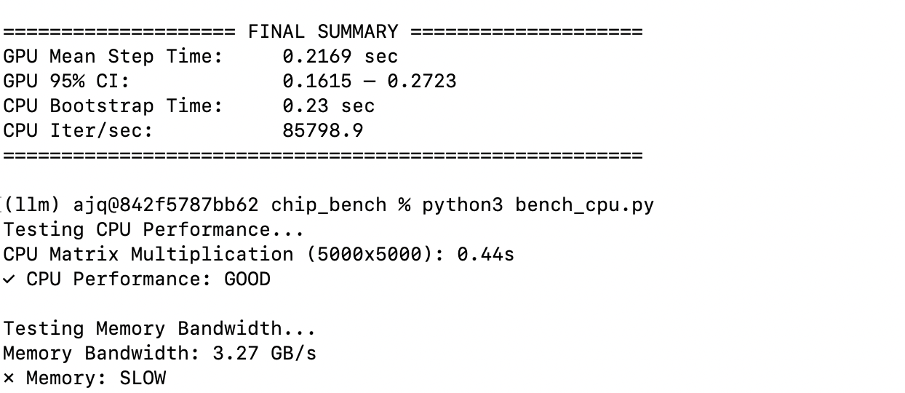

## Steps to check macbook health

### General Battery Check
* System > Battery: Normal
* System > system report > power > check cycle

### performance check
#### General installation
1. install homebrew
2. install miniconda
3. install python packages
```
brew install llama.cpp # maybe also ollama later
conda create --name llm
conda install pip
pip3 install numpy scipy psutil
pip3 install --pre torch torchvision --index-url https://download.pytorch.org/whl/nightly/cpu
pip3 transformers accelerate
```
4. install vscode (optional)
5. install git

#### Steps
* install geekbench
* run the relevant files in this directory for device history CPU benchmark GPU benchmark etc. 
Reference performance (M4 pro):
* ~18 seconds for `llm8b_cpp.py`


* Reference from previous M1 pro
24 seconds with caching (55 from dry run)


